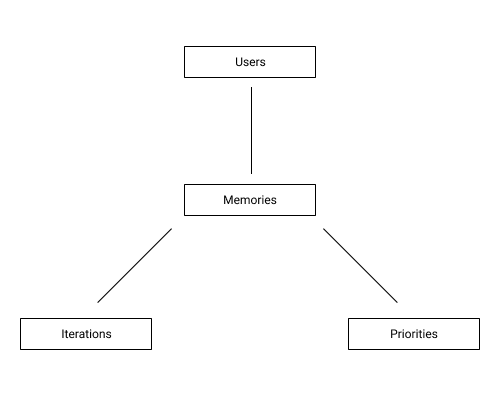
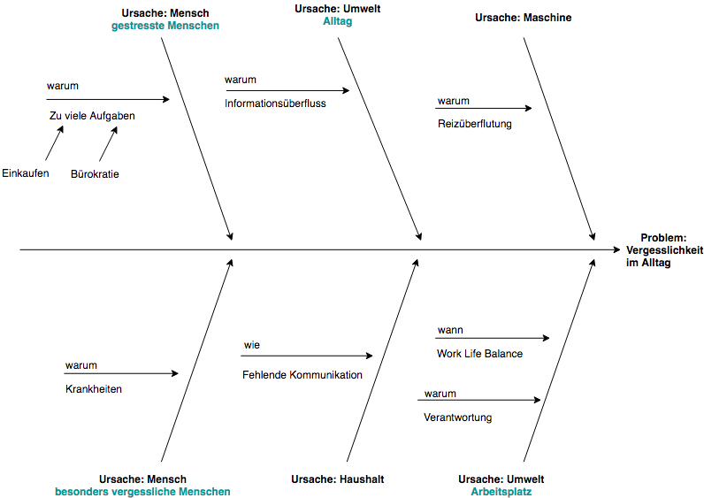

# Exposé EISWS1819MayerSchoemaker

 

## Ortsbezogene Erinnerungen

### Problemszenario

#### Szenario 1
Die beiden Freunde Lea und Robin kommunizieren meist über Whatsapp miteinander. Oft kommt es aber vor, dass sie Dinge lieber unter 4 Augen besprechen wollen. 
Wenn sie sich dann aber treffen, haben sie meist vergessen über die Themen zu sprechen.

##### Lösungsansatz
Es muss eine Möglichkeit geben, dass die beiden an ihr Gesprächsthema erinnert werden, sobald sie sich treffen.

### Domänenmodell

 

### Ursache-Wirkungsdiagramm

  

### Anwendungslogik

#### Clientseitig

* Gibt eine selbstdefinierte Information, wenn sich zwei Personen an einem Ort befinden
  * Nicht interaktionsgetrieben, da Benutzer die Anwendung nicht direkt benutzt.
  * Datenanreicherung dadurch, dass wir tracken, dass die Person an einem Ort war, die Erinnerung aber nicht abgehakt wurde (werden dann in serverseitiger Anwendungslogik genutzt).
  * Dadurch wird im Hintergrund die Erinnerung beim nächsten Mal wieder angezeigt und höher priorisiert.

#### Serverseitig

* Nicht abgehakte Erinnerungen werden durch die getrackten Daten auf der Clientseite priorisiert
  * Nicht interaktionsgetrieben, da Clientseite Daten an Serverseite übergibt, die wir für die Priorisierung nutzen
  * Das System stellt die höher priorisierten Erinnerungen dann auffälliger dar.
  * Erinnerungen werden an den/die anderen Benutzer der jeweiligen Erinnerung geteilt, wenn die Priorisierung einen gewissen Wert überschreitet.

### Relevanz

#### Gesellschaftliche Relevanz

- Durch die Möglichkeit der Lokalisierung im Zusammenhang mit Benachrichtigung ergibt sich großes Potential bei der Unterstützung im Alltag.

#### Wirtschaftliche Relevanz

- Möglichkeit zur Verbindung mit vielen Geräten (Internet of Things)
- Marktlücke, da bisher nur Erinnerungen an Termine und Orte gebunden werden können (Apple und Google).

### Erste Zielsetzung

- Die gesellschaftliche Relevanz steht über der wirtschaftlichen.
- Das System soll sowohl als Einzelperson, als auch für Gruppen genutzt werden können.
