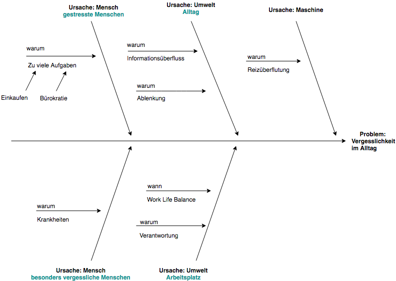

# Exposé EISWS1819MayerSchoemaker

## Personenbezogene Erinnerungen

### Problemszenario

#### Szenario 1

Die beiden Freunde Lea und Robin kommunizieren meist über Whatsapp miteinander. Oft kommt es aber vor, dass sie Dinge lieber unter 4 Augen besprechen wollen.
Wenn sie sich dann aber treffen, haben sie meist vergessen über die Themen zu sprechen.

#### Szenario 2

Bei der Firma XL Software kommt es oft vor, dass zwei Mitarbeiter noch offene Punkte in Projekten besprechen müssen.
Sie kommen sich jedoch mehrmals am Tag im Flur entgegen oder treffen sich zufällig in der Küche und vergessen dann die Punkte zu klären.
So kommt es immer wieder dazu, dass unnötig Wege gemacht werden oder sich Projekte verzögern.

##### Lösungsansatz
Es muss eine Möglichkeit geben, dass die beiden an ihr Gesprächsthema erinnert werden, sobald sie sich treffen/aufeinander treffen.

### Domänenmodell

 

### Ursache-Wirkungsdiagramm

  

### Anwendungslogik

#### Clientseitig

* Gibt eine selbstdefinierte Information, wenn sich zwei Personen an einem Ort befinden.
  * Nicht interaktionsgetrieben, da Benutzer die Anwendung nicht direkt benutzt.
  * Datenanreicherung dadurch, dass wir tracken, dass die Person sich mit einer Anderen getroffen hat, die Erinnerung aber nicht abgehakt wurde (werden dann in serverseitiger Anwendungslogik genutzt).
  * Dadurch wird im Hintergrund die Erinnerung beim nächsten Mal wieder angezeigt und höher priorisiert.

#### Serverseitig

* Nicht abgehakte Erinnerungen werden durch die getrackten Daten auf der Clientseite priorisiert und an die Serverseite übergeben.
  * Wenn die Priorisierung einen gewissen Wert überschreitet, wird die Erinnerung an den anderen Benutzer der jeweiligen Erinnerung geteilt.
  * Nicht interaktionsgetrieben, da automatische Weiterleitung.

### Relevanz

#### Gesellschaftliche Relevanz

- Durch die Möglichkeit der Lokalisierung im Zusammenhang mit Benachrichtigung ergibt sich großes Potential bei der Unterstützung im Alltag.

#### Wirtschaftliche Relevanz

- Möglichkeit zur Verbindung mit vielen Geräten (Internet of Things)
- Marktlücke, da bisher nur Erinnerungen an Termine und Orte gebunden werden können (Apple und Google).

### Erste Zielsetzung

- Die gesellschaftliche Relevanz steht über der wirtschaftlichen.
- Das System soll für Einzelpersonen genutzt werden können, die sich mit Anderen Personen mittels 1 zu 1 Kommunikation verbinden.
