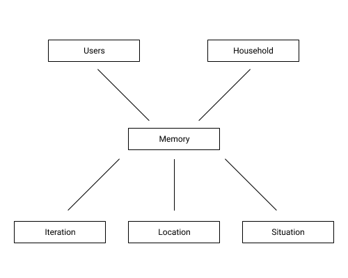

# Exposé EISWS1819MayerSchoemaker

 

## Ortsbezogene Erinnerungen

### Problemszenario

#### Szenario 1

Die beiden Studenten Robin und Sebastian leben in einer Wohngemeinschaft. Beide unterstützen sich beim Einkaufen von Nahrung oder anderen Produkten. Wenn Robin in der Stadt ist, bringt er des öfteren Dinge aus dem Supermarkt für Sebastian mit. Leider kommt es auch oft vor, dass einer der beiden am Supermarkt vorbei läuft, obwohl er Zeit hätte etwas mitzubringen, oder nur für sich selbst einkauft, da vergessen worden ist nachzufragen, was der andere haben wollen würde.

##### Lösungsansatz zu Szenario 1

Es muss möglich sein informiert zu werden, wenn man sich in der Nähe eines Geschäftes befindet und eine Person aus dem gleichen Haushalt etwas aus diesem Geschäft benötigt. 

#### Szenario 2 

Die 65 jährige alleinlebende Gerlinde ist in letzter Zeit in gewissen Situationen vergesslicher geworden. Sie möchte gerne weiterhin zu Hause wohnen und nicht in eine Pflegeeinrichtung ziehen, da sie körperlich noch sehr fit ist. Es ist leider schon ein paar Mal vor gekommen, dass Gerlinde beim täglichen Spaziergang mit dem Hund vergessen hat den Herd auszumachen oder bei Regen die Fenster zu zu machen.

##### Lösungsansatz zu Szenario 2

Wenn man einen gewissen Ort verlässt, soll man an Dinge erinnert werden. Zusätzlich soll beim Verlassen des Ortes geprüft werden, ob andere situationsabhängige Erinnerungen zu beachten sind (z.B. Wetter).

#### Szenario 3

Hans arbeitet unter der Woche 300 Kilometer entfernt von seiner Familie in Hamburg. Dort hat er eine eigene Wohnung, in der er je nach Arbeitswoche 2,3 oder auch 4 Tage wohnt. Aus diesem Grund lässt Hans seine private Post zur Wohnung senden, damit er sie zeitnah öffnen und lesen kann. Zu Hause übernimmt das seine Frau, sodass Hans bereits einige Male vergessen hat, innerhalb der Tage in Hamburg, seinen Briefkasten zu öffnen. 

##### Lösung zu Szenario 3 

Wiederkehrende Erinnerungen, die aber einen Ort gebunden sind, der nicht immer gleichermaßen besucht wird, sollten mit einem Intervall angegeben werden können.

### Domänenmodell

 

### Ursache-Wirkungsdiagramm

 

### Anwendungslogik

---

\1.     Es muss ein Nutzungsproblem identifiziert und lösungsunabhängig beschrieben werden.

\2.     Es muss eine eindeutige, entscheidbare, sowie Technologie- und Lösungsunabhängige Zielsetzung für das Projekt formuliert werden.

\3.     Die Zielsetzung muss Raum für eine Verteiltheit von Anwendungslogik über mehrere Systemkomponenten hinweg bieten.

\4.     Das Projekt muss eine gesellschaftliche und / oder wirtschaftliche Relevanz aufweisen.

 <!-- 

#### Szenario 3

Bürokauffrau Silke sitzt an ihrem Arbeitsplatz und legt eine kurze Pause sein. Dabei fällt ihr ein, dass sie zu Hause am morgen vergessen hat die Waschmaschine auszuräumen und auch die Geschirrspülmaschine noch nicht angestellt ist. Sie weiß leider noch nicht, wann sie Feierabend hat, will die beiden Dinge dann aber möglichst direkt zu Hause erledigen.

##### Lösungsansatz zu Szenario 3 

--> 