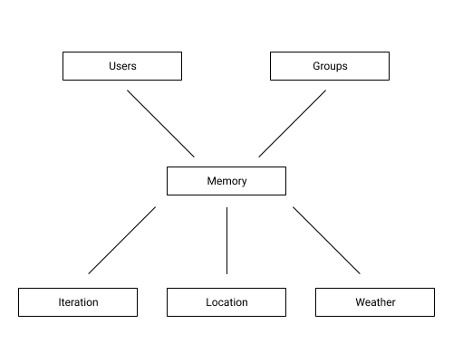
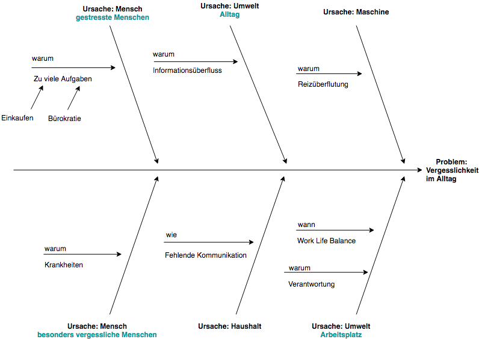

# Exposé EISWS1819MayerSchoemaker

 

## Ortsbezogene Erinnerungen

### Problemszenario

#### Szenario 1
Die beiden Studenten Robin und Sebastian leben in einer Wohngemeinschaft. Beide unterstützen sich beim Einkaufen von Nahrung oder anderen Produkten. Wenn Robin in der Stadt ist, bringt er des Öfteren Dinge aus dem Supermarkt für Sebastian mit. Leider kommt es auch oft vor, dass einer der beiden am Supermarkt vorbeiläuft, obwohl er Zeit hätte etwas mitzubringen, oder nur für sich selbst einkauft, da vergessen worden ist nachzufragen, was der andere haben wollen würde.
##### Lösungsansatz zu Szenario 1
Es muss möglich sein informiert zu werden, wenn man sich in der Nähe eines Geschäftes befindet und eine Person aus dem gleichen Haushalt (Gruppe oder Firma) etwas aus diesem Geschäft benötigt.
#### Szenario 2
Die Hausfrau Silke hat 4 Kinder. Jede Woche fällt dadurch viel Wäsche an. Es ist leider schon ein paar Mal vorgekommen, dass Silke bei Regen vergessen hat die Wäsche rein zu holen oder in allen Kinderzimmern die Fenster zu zu machen.
##### Lösungsansatz zu Szenario 2
Wenn man sich an einem gewissen Ort befindet, soll man bei bestimmter Wetterlage eine selbstdefinierte Erinnerung erhalten.
#### Szenario 3
Hans arbeitet unter der Woche 300 Kilometer entfernt von seiner Familie in Hamburg. Dort hat er eine eigene Wohnung, in der er je nach Arbeitswoche 2,3 oder auch 4 Tage wohnt. Aus diesem Grund lässt Hans seine private Post zur Wohnung senden, damit er sie zeitnah öffnen und lesen kann. Zu Hause übernimmt das seine Frau, sodass Hans bereits einige Male vergessen hat, innerhalb der Tage in Hamburg, seinen Briefkasten zu öffnen.
##### Lösung zu Szenario 3
Wiederkehrende Erinnerungen, die aber einen Ort gebunden sind, der nicht immer gleichermaßen besucht wird, sollten mit einem Intervall angegeben werden können.

### Domänenmodell

 

### Ursache-Wirkungsdiagramm

  

### Anwendungslogik

#### Clientseitig

* Gibt eine selbstdefinierte Information, wenn man sich einem Ort nähert, zu dem eine Erinnerung angegeben ist.
  * Nicht interaktionsgetrieben, da Benutzer die Anwendung nicht direkt benutzt.
  * Datenanreicherung dadurch, dass wir tracken, dass die Person an einem Ort war, die Erinnerung aber nicht abgehakt wurde.
  * Dadurch wird im Hintergrund die Erinnerung beim nächsten Mal wieder angezeigt.
* Gibt eine selbstdefinierte Information, wenn sich das Wetter an einem Ort verändert. 
  * Nicht interaktionsgetrieben, da geprüft wird, wo sich der Benutzer befindet und über eine Wetter API das Wetter hierfür geprüft wird.
  * Wir reichern Daten an, indem wir die Daten zu Orten mit denen des Wetters zusammenführen.
  * Vorhersage nutzen, um zu sagen, wann man die Wäsche rein holen muss, da es bald regnen wird oder es so warm ist, dass sie schnell trocken sein wird.

#### Serverseitig

* Erstellte Erinnerungen bei mehrfacher Nutzung priorisieren, sodass sie als Vorschläge an den Benutzer geschickt werden.
  * Nicht interaktionsgetrieben, da getrackt wird, ob man eine Erinnerung häufig genutzt hat.
  * Das System kann dann eigenständig daran erinnern
  * Definierte Parameter aus z.B. Häufigkeit und aktueller Wetterlage
* Anreicherung von Daten dadurch, dass (für eine Gruppe) getrackt wird wir oft eine Person Erinnerungen (nicht) erledigt hat
  * Berechnung z.B. von durchschnittlichen Erinnerungen in der Woche und/oder der Relation von erledigten und erstellten Erinnerungen.

### Relevanz

#### Gesellschaftliche Relevanz

- Durch die Möglichkeit der Lokalisierung und Benachrichtigung ergibt sich großes Potential bei der Unterstützung im Alltag.
- Da Stress eine immer größere Rolle spielt, fällt es vielen Menschen schwer an alle Dinge denken zu können, die sie zu erledigen haben (Stresslindernd).
- Durch die Möglichkeit der Erstellung von Gruppen kann das Klima in einer Wohngemeinschaft verbessert werden.

#### Wirtschaftliche Relevanz

- Durch die Möglichkeit der Erstellung von Gruppen kann Geld gespart werden, da z.B. Autfahrten zu Geschäften verringert werden.
- Möglichkeit zur Verbindung mit vielen Geräten (Internet of Things)
- Marktlücke, da bisher nur über Google Home (mit Alexa) abgebildet.

### Erste Zielsetzung

- Die gesellschaftliche Relevanz steht über der wirtschaftlichen.
- Mit dem System soll Stress verringert und somit die Lebensqualität verbessert werden.
- Das System soll sowohl als Einzelperson, als auch für Gruppen genutzt werden können.
